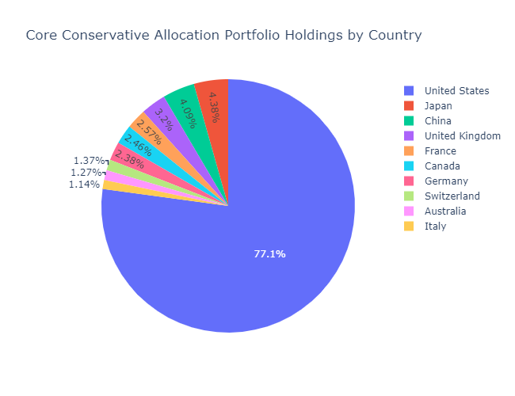
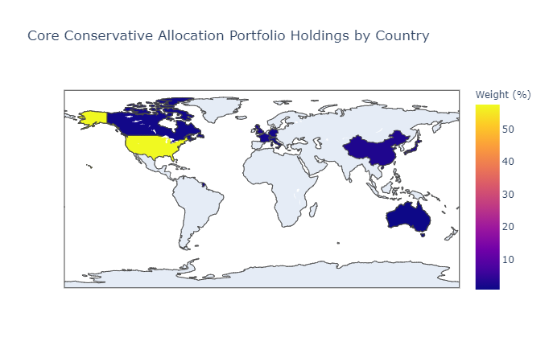

# T.BOT

## Personalized Rob-Advisor

### Team 3: Greg, Vishal, Rimi, Dmitry & Jonathan
________________________
### T.Bot provides investing guidance based on a series of user inputs that takes in information such as user age, investment horizon, risk factors, and initial investment to drill down to a custom, personal investing solution without the need to consult financial advisors or pay those high mutual fund fees. 

### T.Bot is programmed to take in user inputs and output a specific portfolio type that the user can feel comfortable investing in, whether short-term or long-term. The portfolios are actively managed to keep the specific balance in the portfolio which gives the user peace of mind and allows them to continually invest without the need to re-balance or worry about allocation.


# Getting Started

The project was developed in two stages:
1.	The first part dealt with fetching the data, constructing portfolios, performing portfolio analysis, producing visualizations and coding of key logical components of TBot. This step was completed in JupyterLab.
2.	The second part dealt with producing the webapp and this was achieved by using Streamlit library. The .ipynb file developed in the first part of the project was converted into .py file so that it could be fed into Streamlit and the website itself was coded directly in the .py file.
 
# Prerequisites
The Jupiter Notebook file developed in Part 1 of the project required the following libraries and dependencies:

```
import panel as pn

pn.extension('plotly')

import plotly.express as px

import plotly.graph_objects as go

from plotly.subplots import make_subplots

import pandas as pd

import numpy as np

import hvplot.pandas

import matplotlib.pyplot as plt

import os

from pathlib import Path

from dotenv import load_dotenv

import alpaca_trade_api as tradeapi

from MCForecastTools import MCSimulation

plt.style.use('fivethirtyeight')

from scipy import stats

import datetime

%matplotlib inline
```
Please note that some of these libraries were used to produce charts in .ipynb and then later had to be disabled once converted into .py file since they were found to be incompatible with Streamlit.


Part 2 of the project, where we developed the webapp in Streamlit, additionally required the following libraries and dependencies:
```
import streamlit as st
import time
From PIL import Image
```

# Installing Streamlit

Streamlit can be installed via pip install:
```
pip install streamlit
```
Now run the hello world app to make sure everything is working:

```
streamlit hello
```
# Running the WebApp
The code for the webapp demonstrated during the presentation is stored in the file TBOT_with_Data_V2-Copy1.py. To run the webapp, please navigate to the folder where the file is saved and run the following command:

```
streamlit run TBOT_with_Data_V2-Copy1.py

```


# Data
For this project, we used Alpaca do download market data for ETFs and .csv files to get data about ETFs holdings and key facts. 

The Jupyter Notebook file contains the code for running the Monte Carlo simulations, however in the final code in the .py file, Monte Carlo code was disabled (but left in the code for future reference) and replaced by fetching the Monte Carlo analysis results from .csv files in order to improve the performance of the webapp.

# env File

The user of the code needs to use his/her own Alpaca and Mapbox keys to run the code. 

# Step-by-Step Explanation of the Code
## Part 1: Data Analysis
•	Import Dependencies

•	Load Environment Variables and Set Up Alpaca Environment

•	Create Alpaca API Environment

•	Define Function that Returns a Data Frame from Alpaca for the List of Securities

•	Specify Portfolio Composition (tickers) and Weights

•	Create Data Frames for All Portfolios

•	Calculation and Plotting of Historical Cumulative Returns & Growth of Hypothetical $10,000 Investment

•	Construct Tables and Charts for All Portfolios Asset Mix and Country Allocation

Examples:






•	Perform Quantitative Analysis of Portfolios

•	Construct tables for each ETF’s holdings

## Part 2: TBox webapp

•	Import Additional Dependencies

•	Personal Information Module

•	Determine the Risk Tolerance Module

•	Financial advice module

•	Resolve the compatibility issues between Streamlit and some visualization libraries.

